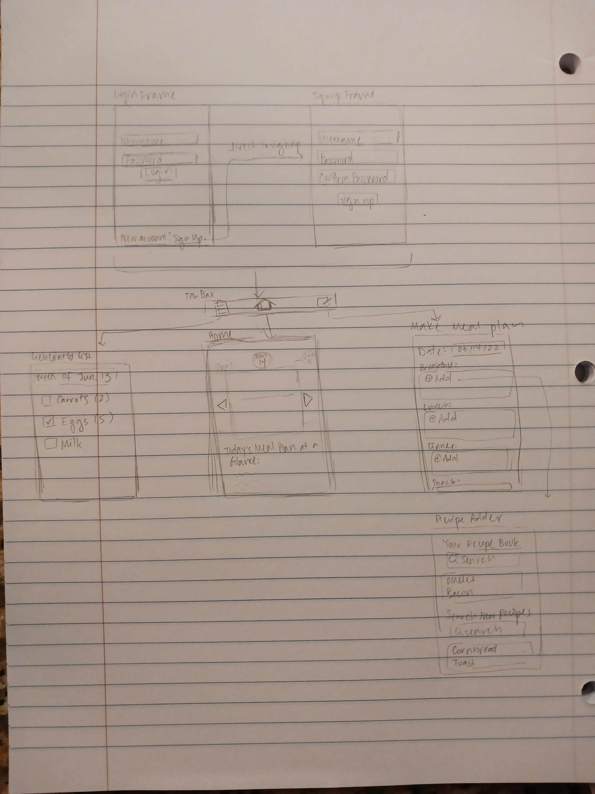

# Mealist

## Description
Mealist is an app that generates weekly grocery lists based on the user's meal plans. Users can also search for new recipes, get recipes/meal plans recommended to them, and view the nutritional information for their daily meal plans.

## Demo
[](https://www.youtube.com/watch?v=hONBuDTK4Nw "Mealist Demo")

## Product Spec

### User Stories (Required and Optional)

**Required Must-have Stories**

- [x] Users can log in and save recipes
- [x] Saved recipes show nutrition information
- [x] Saved recipes used to generate grocery shopping list for the week
- [x] Users can associate their saved recipes with a date/time
- [x] Checkboxes to mark what's been bought

**Optional Nice-to-have Stories**

- [x] Recommendations
- [x] Sectioned grocery list
- [x] Profile page for viewing favorites and recents
- [x] Automatic API key swapping

<!-- ### 2. Screen Archetypes

* Login/Register screens
    * Users can log in and save recipes
* Home Screen/Day at a Glance
    * Users can associate their saved recipes with a date/time
    * Saved recipes show nutrition information
* Generated Grocery List
    * Saved recipes used to generate grocery shopping list for the week
    * Checkboxes to mark what's been bought already
    * Sections representing which aisle each ingredient is found in
* Meal plan creation page
    * Create a meal plan for a particular date
    * Generate a meal plan for a particular date
* Recipe search page
    * Search up recipes to add to a meal plan
    * Get recommended recipes to add to a meal plan
* Recipe detail view
    * Shows a picture of the recipe, the ingredients in a recipe, and the nutritional information
* Profile
    * Shows recently added recipes
    * Shows recipes that have been favorited by the user

 ### 3. Navigation

**Tab Navigation** (Tab to Screen)

* Generated List
* Day at a Glance
* Create Meal Plan

**Flow Navigation** (Screen to Screen)

* Recipe Search Page
    * when + is clicked in Create Meal Plan

 * [list second screen here]
   * [list screen navigation here]
   * ... -->

## Wireframes


## Credits
External libraries:
- [Glide](https://github.com/bumptech/glide)
- [SectionedRecyclerViewAdapter](https://github.com/luizgrp/SectionedRecyclerViewAdapter)

Database:
- Parse via [Back4App](https://www.back4app.com/login)

API:
- [Spoonacular](https://spoonacular.com/food-api)

Design: 
- [Amy Liu, Emily Phally, Megan Phi](https://www.behance.net/gallery/144061749/Public-Transit-UXUI-Case-Study)


<!--## Schema
### Models
#### User
| Property      | Type     | Description |
   | ------------- | -------- | ------------|
| objectId      | String   | unique id for the user|
| savedRecipes  | Array    | list of recipes saved by user |
| username       | String   | user's username|
| name | String   | user's name |

#### Grocery List
| Property      | Type     | Description |
   | ------------- | -------- | ------------|
| objectId      | String   | unique id for the grocery list |
| owner        | Pointer to User| grocery list owner |
| ingredients   | Array | list of ingredient strings |
| quantities     | Array | list of ingredient quantities (index of ingredient corresponds to index of quantity)|
| units     | Array | list of quantity units (index of unit corresponds to index of quantity)|
| startRange     | DateTime |first day grocery list is relevant for|
| endRange     | DateTime |last day grocery list is relevant for|

#### Meal Plan
| Property      | Type     | Description |
   | ------------- | -------- | ------------|
| objectId      | String   | unique id for the meal plan |
| owner        | Pointer to User| meal plan owner |
| breakfast   | Array | list of recipes |
| lunch     | Array | list of recipes|
| dinner     | Array | list of recipes|
| dayOf     | DateTime | date that meal plan is for |
#### Recipe
| Property      | Type     | Description |
   | ------------- | -------- | ------------|
| objectId      | String   | unique id for the recipe|
| meal time | String | breakfast lunch or dinner |
| ingredients     | Array | list of ingredients for recipe |
| quantities | Array | list of quantities for recipe|
| units | Array | list of units for quantities |


### Networking
- Login Screen
    - (Read/GET) Log in based on provided user info
    ```java
          ParseUser.logInInBackground(username, password, new LogInCallback() {
           @Override
           public void done(ParseUser user, ParseException e) {
               if (e != null) {
                   Log.e(TAG, "Issue with login", e);
                   return;
               }

               else {
                   goMainActivity();
               }
           }
       });
        ```
- Register Screen
    - (Create/POST) Create a new user
- Make Meal Plan
    - (Read/GET) Query breakfast, lunch, dinner on dayOf where the owner is the User

    - (Create/POST) Add recipe for meal
    - (Delete) Delete recipe from meal
- Recipe Adder
    - (Read/GET) Query saved recipes for user
    - (Update/PUT) Update saved recipes for user
- Grocery List
    - (Update/PUT) Update checkboxes for which groceries have been bought


### API endpoints

#### Spoonacular
- Base URL - https://api.spoonacular.com/recipes
  HTTP Verb | Endpoint | Description
  ----------|----------|------------
  `GET`    | /complexSearch | search recipes
-->
